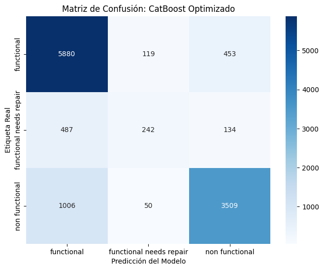
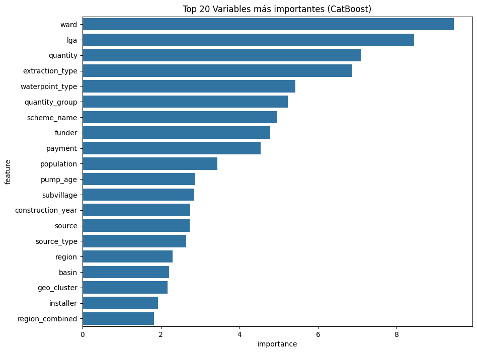
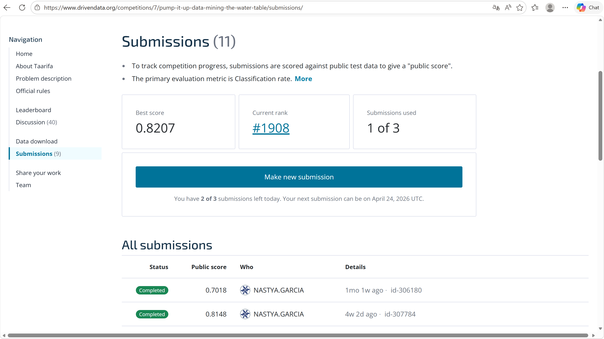

# Pump It Up — Water Pump Classification

### Multiclass classification with data-quality analysis, feature engineering and CatBoost

This project predicts the operational status of water pumps using mixed numerical and categorical data. It was developed as a Machine Learning competition project and emphasizes **data cleaning, masked-missing-value treatment, feature engineering, model comparison and validation**.

---

## Project Highlights

- Multiclass classification: `functional`, `functional needs repair`, `non functional`
- Detailed missing-value and masked-zero analysis
- Feature engineering from temporal, geographical and infrastructure variables
- Comparison of Random Forest, HistGradientBoosting and CatBoost
- **CatBoost hold-out validation accuracy: 0.8107**
- **3-fold stratified CV mean accuracy: 0.8042 ± 0.0017**
- **Best public competition score: 0.8207**
- Explicit analysis of minority-class performance and model limitations

---

## Model Comparison

| Model | Validation accuracy |
|---|---:|
| CatBoost | **0.8107** |
| Random Forest | 0.7587 |
| HistGradientBoosting | 0.7387 |

CatBoost was selected because it achieved the strongest validation performance and handled mixed numerical and categorical features effectively.

---

## Validation Detail

For the selected CatBoost model:

| Class | Precision | Recall | F1 |
|---|---:|---:|---:|
| functional | 0.80 | 0.91 | 0.85 |
| functional needs repair | 0.59 | 0.28 | 0.38 |
| non functional | 0.86 | 0.77 | 0.81 |

The minority `functional needs repair` class remained the hardest to identify, which is an important limitation of the final model.



---

## Feature Importance



The model relied on a combination of geographical, temporal, infrastructure and engineered variables.

---

## Competition Result

The workflow was developed iteratively across multiple submissions.

- **Best public score:** 0.8207
- **Final documented notebook submission:** 0.8183

The final notebook version was retained because it represented the more complete methodological workflow, even though its public score was slightly below the best individual submission.



---

## Repository Structure

```text
pump-it-up-water-pump-classification/
├── data/
│   └── README.md
├── images/
├── notebooks/
│   └── pump_it_up_classification.ipynb
├── results/
├── src/
│   ├── preprocessing.py
│   └── modeling.py
├── .gitignore
├── README.md
└── requirements.txt
```

---

## Data Policy

The original competition datasets are **not redistributed** in this public repository.

To reproduce the workflow, obtain the competition data from the original platform and place the expected files in `data/`.

Row-level test predictions and submission CSV files are also excluded.

---

## Technology Stack

- Python
- pandas
- NumPy
- scikit-learn
- CatBoost
- Matplotlib
- seaborn
- Jupyter / Google Colab
- Git / GitHub

---

## Limitations

- The target is imbalanced, with `functional needs repair` substantially underrepresented.
- Overall accuracy is stronger than minority-class recall.
- Competition leaderboard score is reported separately from local validation.
- Feature importance describes model behavior and is not causal.

---

## Author

**Anastasia García Reziapova**

Machine Learning project  
Data Science, Big Data & Business Analytics
